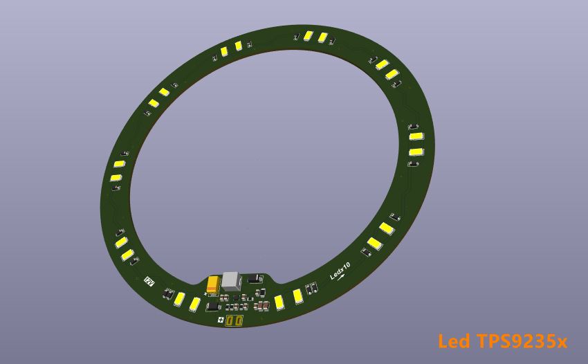

# Ledx10

照明用 LED 驱动芯片驱动多颗 LED 时，连接方式需根据 LED 驱动芯片的类型（恒流源 or 恒压源）、输入电源电压（如 5V、12V、24V、AC-DC 等）以及单颗 LED 的正向压降（Vf，通常白光 LED 为 2.8V~3.6V）来决定。

## 1. LED 参数

工作电流（If）：20mA（指示灯），350mA/700mA/1A（照明级）。

单颗 LED 正向压降（Vf）：3.0V ~ 3.4V。

## 2. 连接

优先串联，大多数专用 **LED 恒流驱动芯片**（如 LM3409、AL8860、PT4115、TLD5098 等）设计用于 **驱动串联 LED 串**。

因为：恒流源要求负载为单一电流路径。串联可保证每颗 LED 电流一致，亮度均匀。无电流分配不均问题。

## 3. 分组

串联连接时，点数越多要求 LED 驱动芯片输出的电压越高，若电压不够，可以选用 **升压型 LED 恒流驱动芯片**，既安全又高效。但是升压型驱动芯片的电压也不是无限的，当 LED 串联总电压高于驱动芯片最大设计输出电压时可以按串并联进行分组设计。

例如：有 10 颗 LED，若驱动芯片最大设计输出电压为 **24V**，最多支持：24V ÷ 3.2V ≈ **7 颗串联**，此时必须按照串联和并联组合重新分组。

**输出电压 12V：**

2 串 × 5 并（即 2 串，每串 5 颗），每串压降 ≈ 16V，不可行（超压） 。

5 串 × 2 并（即 5 串，每串 2 颗）每串压降 ≈ 6.4V，总电流 = 2×If ，可行（需恒流+均流）。

**输出电压 24V：**

3 串 × 3+1（即 3 串，每串 3 颗，和一颗并联） 不均衡（避免）。

2 串 × 5 颗（即 2 串，每串 5 颗），每串 5×3.2=16V < 24V（最佳）。

**输出电压 36V：**

1 串 × 10 颗，压降≈32V < 36V，最理想。

**结论：**

若有 ≥36V 电源 10 颗全串联最佳，若只有24V 电源 2 串，每串 5 颗，若只有 12V 电源 5 串，每串 2 颗（但需注意并联均流）。

### 注意

连接照明 LED 的核心原则就是：尽可能将 LED 串联成单串（或少数几串），确保每串电流一致，避免并联不均流问题。

串联和并联组合时要用相同型号的 LED 并联，不能简单并联（恒流源并联会导致电流分配不均，部分 LED 过流烧毁），两串 Vf 略有差异，电流全走 Vf 小的一路导致另一路不亮或亮度极低，此路过流。

## 4. 驱动芯片

10 颗串联（32V@350mA），**降压（Buck）恒流**（如 PT4115，输入 >36V）。

12V 输入 → 驱动 10 颗，**升压（Boost）恒流**（如 AL8861、MT7201）。

多串并联（如 2×5），带多路输出或外接 MOSFET 的恒流 IC。

根据 LED 驱动芯片的输出电压来决定 LED 如何分组，最优解是选择是全串联 + 恒流驱动，若电压不够，**不要强行并联**，而是选用 **升压型 LED 恒流驱动芯片**，既安全又高效。

## 5. 单点失效

一颗 LED 开路（损坏/虚焊/断线）整串熄灭，这在照明应用中确实是个关键可靠性问题。尽管有 “单点失效” 风险，串联仍是恒流驱动下的首选。

因为：电流绝对一致，所有 LED 亮度均匀，无有的亮、有的暗。驱动电路简单，单路恒流即可，成本低、效率高。无热失控风险，并联时 Vf 低的 LED 会抢电流导致过热从而更抢流最终烧毁。

工程上已有成熟方案来平衡串联的电流一致性优势和单点故障风险，所以不是不用串联，而是要防止单点失效或容忍失效。

### 旁路器件

每颗 LED 并联一个 LED 专用旁路二极管或齐纳二极管（Zener）。

**原理：**

当某颗 LED 开路时，其两端电压急剧升高 → 触发并联的保护器件导通 → 电流绕过坏掉的 LED，其余继续工作。

**注意**：

齐纳电压需满足 V_Z > V_f ， V_Z < 驱动芯片最大耐压 / 10，正常时不导通。例如 Vf=3.2V → 选 5.6V 齐纳（常见且安全）。

**缺点：** 

成本略增（10 颗 LED 多 10 个二极管），坏一颗后，总电压下降 ≈3.2V，电流可能微升（但恒流芯片会自动调整）。

### 分组串联

将 10 颗分为 **2 组 × 5 串**（或其他组合），使用 **双通道恒流驱动芯片**（如 TLC5916、AL8805、CAT4101×2）。

一组坏了，另一组仍亮（50% 亮度维持），适用于 **不能容忍全灭** 的场景（如汽车灯、应急照明）。缺点是成本高、电路复杂。
